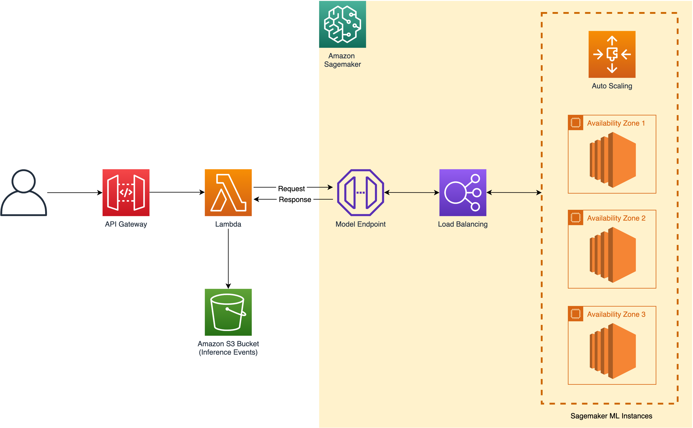

[中文](./README_CN.md)

# Intelligent IP Camera With AI SaaS Solution

## Contents
* [Introduction](#Introduction)
* [Architecture](#Architecture)
* [Deployment](#Deployment)
  * [Things to Know](#Things-to-know)
  * [Configuration Parameters](#Configuration-Parameters)
  * [Deploy via Cloudformation](#Deploy-via-Cloudformation)
  * [Deploy via CDK](#Deploy-via-CDK)
* [Security](#Security)
* [LICENSE](#LICENSE)

## Introduction
This solution aims to empower IP camera industry with artificial intelligence (AI) functionalities based on Amazon Web Services.
It provides face detection, human body detection and face comparison based on Amazon S3, Lambda, API Gateway, 
Sagemaker services. The AI algorithms are packaged in ECS container, which has the advantage of easy to 
expand and pluggable. This solution is an end-to-end SaaS application, and all inference are stored in S3 bucket, which could 
be further used to retrain the model and help customers to improve algorithms' performance with incremental data in real product environment.


Currently this solution support 3 major functions:
- [x] Face Detection
- [x] Human Body Detection
- [x] Face Comparison


## Architecture


The effect of services illustrated in architecture could be detailed as below:
1. Amazon API Gateway: it routes user's request, which includes the request image's base64 encoded sequence. 
1. Amazon Lambda Function: lambda function is responsible for invoke the sagemaker endpoint to infer the response and meanwhile, it stores request image and inference result into S3 bucket.
1. Amazon S3 Bucket: it is used to store the input image and corresponding result of each API request.
1. Sagemaker Endpoint + Load Balancing + ML Instances: the sagemaker endpoint is responsible for processing users' request, i.e., face detection/human body detection/face comparison are all implemented in Sagemaker endpoint, user can integrate autoscaling to control the hosting machines' amount based on work load。


## Deployment

#### Things to Know

- This solution will automatically provision Amazon S3 bucket, API Gateway, Lambda Function, Sagemaker Model/Configuration/Endpoint resources in your deploy account.
- The whole deployment process will take 10-20 minutes。

#### Configuration Parameters

When deploy this solution，user need to specify 5 parameters: `applicationType`，`deployInstanceType`，`detectorModelName`，`faceDetectAndCompareModelName`，`saveRequestEvents`, which is introduced in detail in Table below:

| Parameter Name                | Default Value                                             | Description                                                                                     |
|---------------------------|-----------------------------------------------------|-------------------------------------------------------------------------------------------------|
| `applicationType`       | `face-detection`  | specify the service type of this solution，the value should be one of `face-detection`，`body-detection`， `face-comparison`|
| `deployInstanceType`     | `ml.g4dn.xlarge`  | specify the machine of hosting inference service，the value should be one of  `ml.m5.xlarge`, `ml.g4dn.xlarge` |
| `detectorModelName`     | `yolo3_darknet53_coco`  | specify the detector name of face detection or human body detection，it is worth to mentioning that it is only valid when `applicationType` is configured as `face-detection` or `body-detection`, the detector name should be one of `ssd_512_resnet50_v1_coco`, `yolo3_darknet53_coco`, `yolo3_mobilenet1.0_coco`, `faster_rcnn_fpn_resnet101_v1d_coco` |
| `faceDetectAndCompareModelName`     | `retinaface_mnet025_v2+MobileFaceNet`  | specify face detection model and representation model for face comparison scenario，it is valid when `applicationType` is configured as `face-comparison`, the value should be one of `retinaface_mnet025_v2+LResNet100E-IR`,  `retinaface_mnet025_v2+MobileFaceNet`,  `retinaface_r50_v1+MobileFaceNet` |
| `saveRequestEvents`     | `No`  | boolean flag which indicates to store all inference events (input image and return response) into S3 bucket，the value should be one of `Yes`, `No` |


#### Deploy via Cloudformation

Please follow below steps to deploy this solution via AWS Cloudformation.

1. Sign in to AWS Management Console, switch to the region to deploy the CloudFormation Stack to.

1. Click the following button to launch the CloudFormation Stack in that region.

    - For China Partition (cn-north-1, cn-northwest-1)

    [](https://console.amazonaws.cn/cloudformation/home?region=cn-north-1#/stacks/create/template?stackName=IPCSolutionStack&templateURL=https://aws-gcr-solutions.s3.cn-north-1.amazonaws.com.cn/amazon-ipc-ai-saas/latest/IpcAiSaasStack.template)

    - For Standard Partition (us-east-1, us-west-2)

    [](https://console.aws.amazon.com/cloudformation/home?region=us-east-1#/stacks/create/template?stackName=IPCSolutionStack&templateURL=https://aws-gcr-solutions.s3.amazonaws.com/amazon-ipc-ai-saas/latest/IpcAiSaasStack.template)

1. Click **Next**. Change the stack name if required.

1. Click **Next**. Configure additional stack options such as tags (Optional). 

1. Click **Next**. Review and confirm acknowledgement,  then click **Create Stack** to start the deployment.

> Note: You can simply delete the stack from CloudFormation console if this solution is no longer required.


#### Deploy via CDK

If you want to use AWS CDK to deploy this solution, please make sure you have met below prerequisites:

* [AWS Command Line Interface](https://aws.amazon.com/cli/)
* Node.js 12.x or later
Under the project **source** folder, run below to compile TypeScript into JavaScript. 

```
cd source
npm install -g aws-cdk
npm install && npm run build
```

Then you can run `cdk deploy` command to deploy the solution. Please specify the parameter value if needed, for example:

```
cdk deploy \
--parameters applicationType=face-detection \
--parameters deployInstanceType=ml.g4dn.xlarge \
--parameters detectorModelName=yolo3_darknet53_coco \
--parameters faceDetectAndCompareModelName=retinaface_mnet025_v2+MobileFaceNet \
--parameters saveRequestEvents=Yes
```

> Note: You can simply run `cdk destroy` if the solution task is no longer required. This command will remove the stack created by this solution from your AWS account.


## Security
See [CONTRIBUTING](CONTRIBUTING.md#security-issue-notifications) for more information.

## License
See the [LICENSE](LICENSE) file for our project's licensing. We will ask you to confirm the licensing of your contribution.

