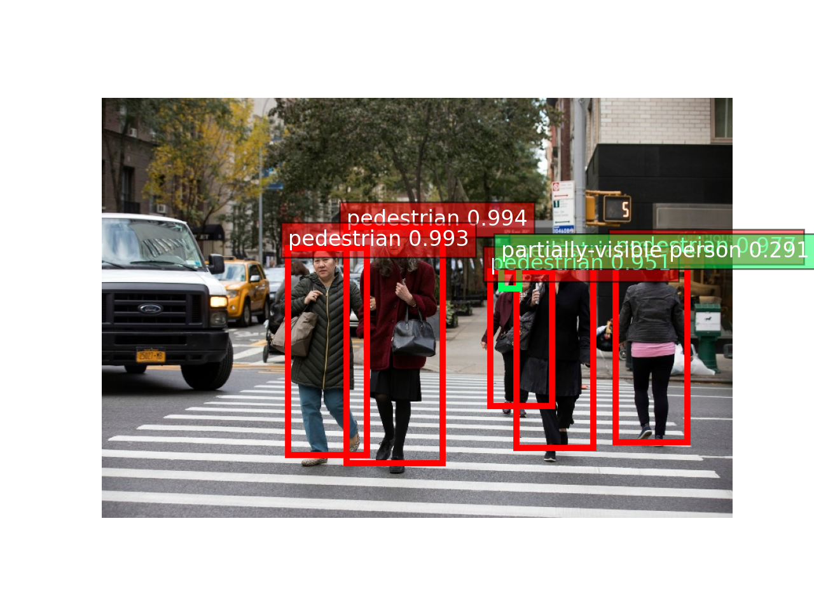
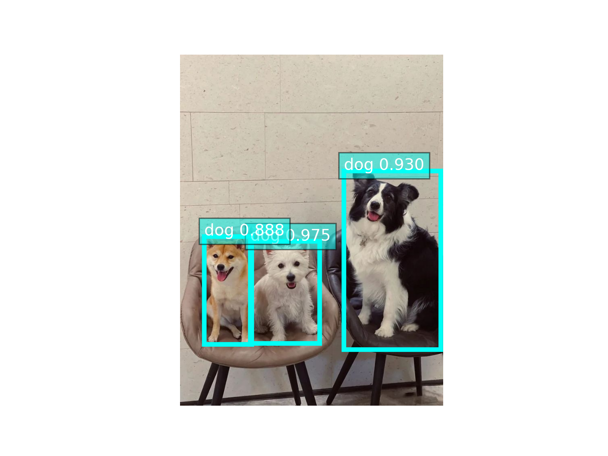
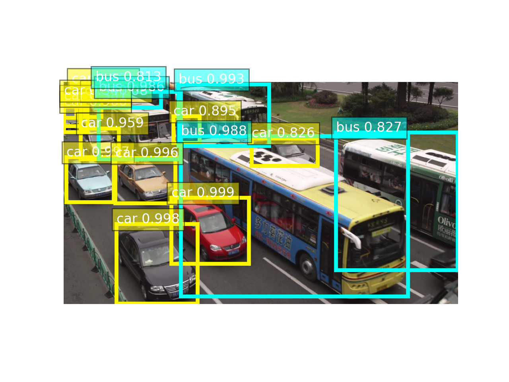

# 智能IP摄像头SaaS服务解决方案

## 目录
* [方案介绍](#方案介绍)
* [方案架构](#方案架构)
* [方案部署](#方案部署)
  * [部署须知](#部署须知)
  * [部署参数](#部署参数)
  * [基于Cloudformation部署](#基于Cloudformation部署)
* [实现细节](#实现细节)
  * [基于Darknet框架训练yolov4模型](#基于Darknet框架训练yolov4模型)
  * [TensorRT模型准备](#TensorRT模型准备)
* [API调用代码示例](#API调用代码示例)
* [并发测试](#并发测试)
* [安全](#安全)
* [许可](#许可)


## 方案介绍
该解决方案基于Amazon S3，Amazon Lambda，Amazon API Gateway，Amazon SageMaker等组件，
旨在为智能IP监控行业（IP Camera）提供人工智能算法赋能。该解决方案提供了人形检测， 宠物检测（猫/狗检测）
和车辆检测三种算法服务，AI算法是封装在ECS Container镜像中进行加载部署为SaaS（Software as a Service）
形式提供给用户调用，具有易拓展，可插拔的优点。用户基于该解决方案架构可以任意进行扩展，该解决方案端到端
地提供了一整套云端SaaS服务，用户可以通过设置将生产环境中的数据及其推理结果存储至Amazon S3桶，
为后期算法的迭代升级提供数据基石。

该解决方案支持的功能如下：
- [x] 人形检测
- [x] 宠物检测（猫/狗）
- [x] 车辆检测

三种算法均基于Darknet Yolo-v4进行训练，并转化为TensorRT版本加速推理。

## 方案架构


架构图中各个组件的功能描述如下:
1. Amazon API Gateway: 路由用户的请求，用户的请求中携带图片的base64编码；
1. Amazon Lambda Function: 将用户的请求转发到Sagemaker Endpoint进行推理，同时负责将请求的图片和Sagemaker Endpoint推理的结果写入S3桶；
1. Amazon S3 Bucket: 用来存储用户API调用的请求图片和推理响应结果（json格式）；
1. Sagemaker Endpoint + Load Balancing + ML Instances: 负责处理用户的推理请求，基于Sagemaker Endpoint对请求图像实现人脸检测，人形检测和人脸比较，用户可以根据Sagemaker Endpoint的托管机器的工作负载对其进行Auto-Scaling，完成大批量高并发的请求服务。


## 方案部署

#### 部署须知

- 该解决方案在部署过程中会自动地在您的账户中配置Amazon S3 Bucket，API Gateway， Lambda，Sagemaker Model/Configuration/Endpoint等等。
- 整个部署过程耗时约为 15-20 分钟。

#### 部署参数

在解决方案部署时，需要指定`applicationType`， `saveRequestEvents`参数:

| 参数                     | 默认值                                               | 描述                                                        |
|-------------------------|-----------------------------------------------------|------------------------------------------------------------|
| `applicationType`       | `persons-detection`  | 配置该解决方案的SaaS服务类型，可选值为 `persons-detection`，`pets-detection`和`vehicles-detection`|
| `saveRequestEvents`     | `No`                 | 配置是否将每一次调用推理时的输入和响应存储至S3桶，可选值为 `Yes`, `No` |


#### 基于Cloudformation部署

请参考下述步骤来基于Cloudformation进行部署：

1. 登录AWS管理控制台，切换到您想将该解决方案部署到的区域；

1. 点击下述按钮（中国与海外）来开启部署，目前仅支持海外`us-east-1`区域和国内`cn-northwest-1`区域；

    - **中国区域 (cn-northwest-1)**

    [](https://console.amazonaws.cn/cloudformation/home?region=cn-north-1#/stacks/create/template?stackName=IPCSolutionStack&templateURL=https://sh-solutions-cn.s3.cn-northwest-1.amazonaws.com.cn/ip-camera-ai-saas/v1.1.0/IpcAiSaasStack.template)

    - **标准（Standard）区域 (us-east-1)**

    [](https://console.aws.amazon.com/cloudformation/home?region=us-east-1#/stacks/create/template?stackName=IPCSolutionStack&templateURL=https://sh-solutions-std.s3.amazonaws.com/ip-camera-ai-saas/v1.1.0/IpcAiSaasStack.template)

1. 点击 **下一步**. 根据您需要可以更改堆栈名称，选择`applicationType`和`saveRequestEvents`（启动`saveRequestEvents`会针对用户每一次调用存储输入图片和输入响应到S3桶，单帧耗时会稍微增加）；

1. 点击 **下一步**. 配置堆栈选项 (可选)；

1. 点击 **下一步**. 审核堆栈配置，勾选 **我确认，AWS CloudFormation 可能创建具有自定义名称的 IAM 资源**，点击 **创建堆栈** 开启创建；

**注意: 当您不再需要该解决方案时，您可以直接从Cloudformation控制台删除它。**


## 实现细节
> 主要阐述如何训练Darknet yolov4目标检测模型，及如何将Darknet yolov4模型转化为TensorRT版本，该小节主要是为了
获得目标检测的TensorRT模型，用来将其封装到ECS推理镜像中。

### 基于Darknet框架训练yolov4模型
#### 1. 训练环境准备
在`Darknet`训练完`Yolo-v4`模型之后，我们需要将其转化为通用的`Tensorflow`模型，并进一步将`Tensorflow`模型
转化为TensorRT版本，这些转化过程以及最后的`TensorRT`推理需要依赖于`tensorflow-gpu`，`libnvinfer-dev=7.1.3-1+cuda11.0`等
一系列依赖库的安装，下述命令是基于Amazon EC2 g4dn.xlarge实例（Ubuntu 18.04 OS)的环境准备过程：

```angular2html
sudo apt-get update
sudo apt-get install -y git cmake awscli libopencv-dev python3-pip
python3 -m pip install --upgrade pip

# install tensorflow-gpu (SHOULD BE VERSION 2.4.0), it matches cuda/cudnn/nvinfer7 versions
pip3 install tensorflow-gpu==2.4.0
pip3 install opencv-python==4.5.2.54
pip3 install easydict==1.9

# add NVIDIA package repositories
wget https://developer.download.nvidia.com/compute/cuda/repos/ubuntu1804/x86_64/cuda-ubuntu1804.pin
sudo mv cuda-ubuntu1804.pin /etc/apt/preferences.d/cuda-repository-pin-600
sudo apt-key adv --fetch-keys https://developer.download.nvidia.com/compute/cuda/repos/ubuntu1804/x86_64/7fa2af80.pub
sudo add-apt-repository "deb https://developer.download.nvidia.com/compute/cuda/repos/ubuntu1804/x86_64/ /"
sudo apt-get update

wget http://developer.download.nvidia.com/compute/machine-learning/repos/ubuntu1804/x86_64/nvidia-machine-learning-repo-ubuntu1804_1.0.0-1_amd64.deb
sudo apt install ./nvidia-machine-learning-repo-ubuntu1804_1.0.0-1_amd64.deb
sudo apt-get update

wget https://developer.download.nvidia.com/compute/machine-learning/repos/ubuntu1804/x86_64/libnvinfer7_7.1.3-1+cuda11.0_amd64.deb
sudo apt install -y ./libnvinfer7_7.1.3-1+cuda11.0_amd64.deb
sudo apt-get update

# install development and runtime libraries (~4GB)
sudo apt-get install -y --no-install-recommends cuda-11-0 libcudnn8=8.0.4.30-1+cuda11.0 libcudnn8-dev=8.0.4.30-1+cuda11.0 --allow-downgrades

# reboot and check GPUs are visible using command: nvidia-smi

# install TensorRT, which requires that libcudnn8 is installed above
sudo apt-get install -y --no-install-recommends libnvinfer7=7.1.3-1+cuda11.0 libnvinfer-dev=7.1.3-1+cuda11.0 libnvinfer-plugin7=7.1.3-1+cuda11.0

echo 'export PATH=/usr/local/cuda/bin:$PATH' >> ~/.bashrc 
echo 'export LD_LIBRARY_PATH=/usr/local/cuda/lib64:$LD_LIBRARY_PATH' >> ~/.bashrc
source ~/.bashrc
```


#### 2. `Darknet`编译
安装`Darknet`环境，将`Darknet Yolov4`克隆到本地目录：
```angular2html
git clone https://github.com/AlexeyAB/darknet.git
```
更改编译选项`Makefile`，使其支持`GPU`训练，如下所示：
```angular2html
GPU=1
CUDNN=1
CUDNN_HALF=1
OPENCV=1
AVX=1
OPENMP=1
LIBSO=1
ZED_CAMERA=0
ZED_CAMERA_v2_8=0
```
开始编译`darknet`，命令如下：
```angular2html
cd darknet
make -j4
```
编译成功会生成一个可执行文件，如下所示：
```angular2html
ubuntu@ip-11-0-1-195:~/darknet$ ls -al darknet
-rwxrwxr-x 1 ubuntu ubuntu 6705768 Jul 14 03:56 darknet
```

#### 3. 创建`Darknet`训练配置文件
以宠物检测为例，共有两个检测类别（猫，狗），我们配置目标检测类别为`2`的配置文件：
```angular2html
cd darknet/cfg/
cp yolov4-custom.cfg yolov4-pets.cfg

# 更改配置，输入宽高改为512；max_batches改为10000；steps改为max_batches的0.8，0.9倍；
# classes改为2（不含背景类）；filters=255改为filters=(classes + 5)x3)
vi yolov4-pets.cfg  

cd ../data/
vi pets.names  # 输入第一行cat，第二行dog保存
vi pets.data   # 输入配置选项
cat pets.data 

# cat pets.data输出如下：
# classes = 2
# train  = data/pets/train.txt
# valid  = data/pets/val.txt
# names = data/pets.names
# backup = backup/

# 下载训练数据
aws s3 cp s3://ip-camera-ai-saas/dataset/pets-detect/pets.zip .
unzip pets.zip

# 下载pre-trained模型
cd ../
mkdir models
cd models/
wget -c https://github.com/AlexeyAB/darknet/releases/download/darknet_yolo_v3_optimal/yolov4.conv.137
```

#### 4. 启动训练
执行如下脚本启动后台训练：
```angular2html
nohup ./darknet detector train data/pets.data cfg/yolov4-pets.cfg models/yolov4.conv.137 -dont_show -mjpeg_port 8090 -map 2>&1 > train.log &
```
   
### TensorRT模型准备

#### 1. CUDA_11.1 + CUDNN_8 + TensorRT_7.2.3 推理环境安装

`TensorRT`可以显著加速推理的速度，为了将`Darknet`训练好的`yolov4`模型转化为`TensorRT`版本，我们首先
借助于 [Open Neural Network Exchange](https://github.com/onnx/onnx) ，将`Darknet`模型转化为`onnx`格式，再将
`onnx`格式转化为`TensorRT`格式。

> Reference:
> - https://docs.nvidia.com/deeplearning/tensorrt/install-guide/index.html#installing-debian
> - https://github.com/jkjung-avt/tensorrt_demos#yolov4

首先进入`Amazon Web Services EC2`控制台，选择`g4dn.xlarge`实例（`Ubuntu 18.04 OS`)并安装软件依赖项（`cuda`, `tensorrt`, `cudnn`等），如下所示：

```angular2html
sudo apt-get update
sudo apt-get install -y git cmake awscli python3-opencv python3-pip
pip3 install --upgrade pip
pip3 install Cython==0.29.24
pip3 install onnx==1.4.1

# Install CUDA 
wget https://developer.download.nvidia.com/compute/cuda/repos/ubuntu1804/x86_64/cuda-ubuntu1804.pin
sudo mv cuda-ubuntu1804.pin /etc/apt/preferences.d/cuda-repository-pin-600
wget https://developer.download.nvidia.com/compute/cuda/11.1.0/local_installers/cuda-repo-ubuntu1804-11-1-local_11.1.0-455.23.05-1_amd64.deb
sudo dpkg -i cuda-repo-ubuntu1804-11-1-local_11.1.0-455.23.05-1_amd64.deb
sudo apt-key add /var/cuda-repo-ubuntu1804-11-1-local/7fa2af80.pub
sudo apt-get update
sudo apt-get -y install cuda

# PATH and LD_LIBRARY_PATH Configuration
echo 'export PATH=/usr/local/cuda/bin:$PATH' >> ~/.bashrc 
echo 'export LD_LIBRARY_PATH=/usr/local/cuda/lib64:$LD_LIBRARY_PATH' >> ~/.bashrc
source ~/.bashrc

# Install pycuda
pip3 install 'pycuda<2021.1'

# Install TensorRT
wget -c https://ip-camera-ai-saas.s3.amazonaws.com/software/nv-tensorrt-repo-ubuntu1804-cuda11.1-trt7.2.3.4-ga-20210226_1-1_amd64.deb .
sudo dpkg -i nv-tensorrt-repo-ubuntu1804-cuda11.1-trt7.2.3.4-ga-20210226_1-1_amd64.deb
sudo apt-key add /var/nv-tensorrt-repo-ubuntu1804-cuda11.1-trt7.2.3.4-ga-20210226/7fa2af80.pub
sudo apt-get update
sudo apt-get install -y tensorrt
sudo apt-get install python3-libnvinfer-dev
```


#### 2. Darknet模型文件转化

首先编译动态库`libyolo_layer.so`，该动态库会在前向推理中被调用。

```angular2html
git clone https://github.com/jkjung-avt/tensorrt_demos.git
cd tensorrt_demos/plugins
make
```

开始模型转化，下载`Darknet`框架中训练好的`yolov4`模型及其对应的配置文件`*.cfg`，
然后将模型转化为`onnx`格式，再转化为`TensorRT`格式。执行命令如下所示：

```angular2html
cd tensorrt_demos/yolo
wget -c https://ip-camera-ai-saas.s3.amazonaws.com/models/persons_detection/yolov4-persons.cfg .
wget -c https://ip-camera-ai-saas.s3.amazonaws.com/models/persons_detection/yolov4-persons_best.weights .
mv yolov4-persons_best.weights yolov4-persons.weights
python3 yolo_to_onnx.py -m yolov4-persons
python3 onnx_to_tensorrt.py -m yolov4-persons --verbose
```
执行完之后可以生成后缀为`.trt`的模型文件，该文件将会被封装成容器镜像供用户进行AI SaaS部署。


## API调用代码示例
在用户部署完该解决方案后，可以采用 [simulate_request.py](./source/simulate/simulate_request.py) 进行调用测试并可视化，
用户需要在调用的主函数中将`endpoint_url`配置为自己账号中部署好的`API Gateway Url`（在`Cloudformation`中部署
的解决方案控制台标签页`outputs`中），将`application_type`配置为`PersonsDetection`，`PetsDetection`和
`VehiclesDetection`三个中的任意一个即可。

```angular2html
simulator = DetectorSimulator(
    endpoint_url="https://your_invoke_url_endpoint",
    application_type='VehiclesDetection'
)
```

调用后的可视化图如下所示：

[comment]: <> ()
[comment]: <> ()
[comment]: <> ()





## 并发测试
该解决方案默认的部署的机型为`g4dn.xlarge`，配置单个`Nvidia T4 GPU`，由于端到端的访问时耗主要由网络传输延时和服务器端处理时间引起的，为了
客观的得到服务器的并发能力，我们基于图像 [persons.jpg](./source/simulate/test_imgs/persons/persons.jpg) 进行并发测试，它的大小为`546x819x3`，
在服务器端进行推理之前，首先需要将图像`resize`到固定的输入大小(`512x512`)，这个过程耗时与输入原始图像的尺寸紧密相关，越大的图像`resize`的时间越显著。

#### 1. HTTP POST请求数据准备
```angular2html
import base64
import json
import time

def get_base64_encoding(full_path):
    with open(full_path, "rb") as f:
        data = f.read()
        image_base64_enc = base64.b64encode(data)
        image_base64_enc = str(image_base64_enc, 'utf-8')

    return image_base64_enc

image_base64_enc = get_base64_encoding(full_path='your_test_image.jpg')

# Step 2: send request to backend
request_body = {
    "timestamp": str(time.time()),
    "request_id": 1242322,
    "image_base64_enc": image_base64_enc
}

json.dump(request_body, open('post_data.txt', 'w'))
```

#### 2. EC2并发请求环境准备
为了得到客观的服务器并发能力，避免网络传输延时的影响，我们配置一台同区域的EC2进行并发测试，如在`us-east-1`区
选择`Amazon Linux 2 AMI (HVM), SSD Volume Type - ami-0c2b8ca1dad447f8a (64-bit x86) / ami-06cf15d6d096df5d2 (64-bit Arm)`
系统镜像，机型选择`t3.small`，在EC2启动后，安装并发请求依赖项，如下所示：

```angular2html
sudo yum update
sudo yum install -y httpd
```


#### 3. 并发请求
```angular2html
ab -p post_data.txt -T application/json -c 80 -n 1000 https://your_api_gateway_output_url/inference
```
参数`-c`表示每秒测试并发数，`-n`表示模拟的总请求数，测试结果如下所示：
```angular2html
Server Software:        
Server Hostname:        lhz2shsh9i.execute-api.us-east-1.amazonaws.com
Server Port:            443
SSL/TLS Protocol:       TLSv1.2,ECDHE-RSA-AES128-GCM-SHA256,2048,128
Server Temp Key:        ECDH P-256 256 bits
TLS Server Name:        lhz2shsh9i.execute-api.us-east-1.amazonaws.com

Document Path:          /prod/inference
Document Length:        904 bytes

Concurrency Level:      80
Time taken for tests:   12.905 seconds
Complete requests:      1000
Failed requests:        6
   (Connect: 0, Receive: 0, Length: 6, Exceptions: 0)
Non-2xx responses:      6
Total transferred:      1308970 bytes
Total body sent:        277586000
HTML transferred:       898792 bytes
Requests per second:    77.49 [#/sec] (mean)
Time per request:       1032.367 [ms] (mean)
Time per request:       12.905 [ms] (mean, across all concurrent requests)
Transfer rate:          99.06 [Kbytes/sec] received
                        21006.49 kb/s sent
                        21105.54 kb/s total

Connection Times (ms)
              min  mean[+/-sd] median   max
Connect:        4   10  16.8      5      92
Processing:    96  719 973.4    553   12724
Waiting:       71  710 970.5    541   12689
Total:        101  728 978.5    559   12804

Percentage of the requests served within a certain time (ms)
  50%    559
  66%    710
  75%    809
  80%    899
  90%   1132
  95%   1339
  98%   2785
  99%   5570
 100%  12804 (longest request)
```
从结果可以看出，95%的请求在1.132秒内返回结果，每秒的并发数达到77.49。


## 安全
更多信息请参阅 [CONTRIBUTING](CONTRIBUTING.md#security-issue-notifications)。

## 许可
该解决方案遵从MIT-0 许可，更多信息请参阅 LICENSE 文件.
