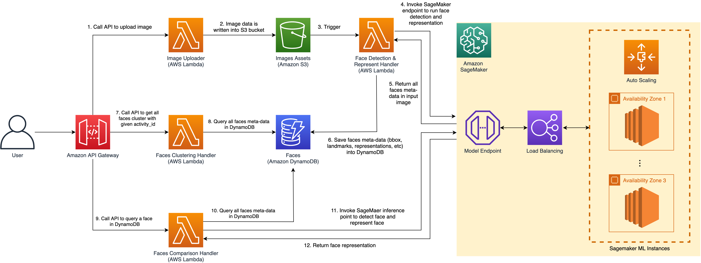

# 基于亚马逊云科技SageMaker的人脸识别解决方案

## 目录
* [方案介绍](#方案介绍)
* [方案架构](#方案架构)
* [方案部署](#方案部署)
  * [部署须知](#部署须知)
  * [部署参数](#部署参数)
  * [基于Cloudformation部署](#基于Cloudformation部署)
* [API调用代码示例](#API调用代码示例)
* [安全](#安全)
* [许可](#许可)

## 方案介绍
该解决方案基于Amazon S3，Amazon Lambda，Amazon API Gateway，Amazon SageMaker，Amazon DynamoDB等组件，
旨在一个包含人脸检测和关键点定位，人脸聚类，人脸检索的解决方案。

该解决方案支持的功能如下：
- [x] 用户上传图片至S3桶，并自动触发对该图片中人脸的检测（人脸位置，眼睛，鼻子，嘴巴的关键点位置）和特征提取；
- [x] 用户查询目前数据库中人脸的聚类，每一个聚类中包含同一个人脸；
- [x] 用户携带一张含有人脸的图片，查询数据库中所有该人的图片数据。

## 方案架构

架构图中各个组件的功能描述如下:
1. Amazon API Gateway: 路由用户的请求；
1. Amazon Lambda Function: 负责图片的上传，人脸检测和表征的调用，人脸聚类，人脸查询比较四个功能；
1. Amazon S3 Bucket: 用来存储用原始的输入图片；
1. Sagemaker Endpoint + Load Balancing + ML Instances: 负责处理用户的推理请求，基于SageMaker Endpoint对请求图像实现人脸检测和人脸表征，用户可以根据SageMaker Endpoint的托管机器的工作负载对其进行Auto-Scaling，完成大批量高并发的请求服务。

## 方案部署

#### 部署须知

- 该解决方案在部署过程中会自动地在您的账户中配置Amazon S3 Bucket，API Gateway， Lambda，Sagemaker Model/Configuration/Endpoint等等。
- 整个部署过程耗时约为 15-20 分钟。

#### 部署参数

在解决方案部署时，需要指定下表所示的参数:

| 参数                     | 默认值                                               | 描述                                                        |
|-------------------------|-----------------------------------------------------|------------------------------------------------------------|
| `deployInstanceType`    | `g4dn.xlarge`  | 选择人脸检测，人脸对齐和人脸特征提取的推理机型  |
| `faceDetectorModel`     | `retinaface_mnet025_v2`                 | 选择人脸检测的模型 |
| `faceRepresenterModel`  | `MobileFaceNet`                 | 选择人脸特征表征的模型 |
| `faceConfidenceThreshold`  | `0.70`                 | 配置人脸置信度阈值，置信度低于该值的人脸将忽略 |
| `filterEyesDistanceThreshold`  | `0.15`                 | 配置人脸是否为正脸的过滤阈值，如果检测出两眼之间的距离在所在脸的宽度中占比小于该阈值，则忽略该脸。该值越大，人脸识别的精确度越高，会丢弃更多的侧脸。 |

#### 基于Cloudformation部署

请参考下述步骤来基于Cloudformation进行部署：

1. 登录AWS管理控制台，切换到您想将该解决方案部署到的区域；

1. 点击下述按钮来开启部署，目前仅支持在中国宁夏区和北京区部署；

    - **宁夏区(cn-northwest-1)**

    

    - **北京区 (cn-north-1)**

    

1. 点击 **下一步**. 根据您需要可以更改堆栈名称，配置解决方案参数；

1. 点击 **下一步**. 配置堆栈选项 (可选)；

1. 点击 **下一步**. 审核堆栈配置，勾选 **我确认，AWS CloudFormation 可能创建具有自定义名称的 IAM 资源**，点击 **创建堆栈** 开启创建；

**注意: 当您不再需要该解决方案时，您可以直接从Cloudformation控制台删除它。**

## API调用代码示例
在用户部署完该解决方案后，可以基于Python实例代码进行调用测试，用户需要在调用的主函数中将`endpoint_url`配置为自己账号中部署好的`API Gateway Url`（在`Cloudformation`中部署
的解决方案控制台标签页`outputs`中)。

三个用户交互的测试Python程序如下所示：
1. 用户上传图片：[simulate_image_uploader.py](./source/simulate/simulate_image_uploader.py)
2. 用户查询数据库中人脸聚类：[simulate_activity_summary.py](./source/simulate/simulate_activity_summary.py)
3. 用户在数据库中搜索某一个指定的人脸：[simulate_face_query.py](./source/simulate/simulate_face_query.py)

## 安全
更多信息请参阅 [CONTRIBUTING](CONTRIBUTING.md#security-issue-notifications)。

## 许可
该解决方案遵从MIT-0 许可，更多信息请参阅 LICENSE 文件.
